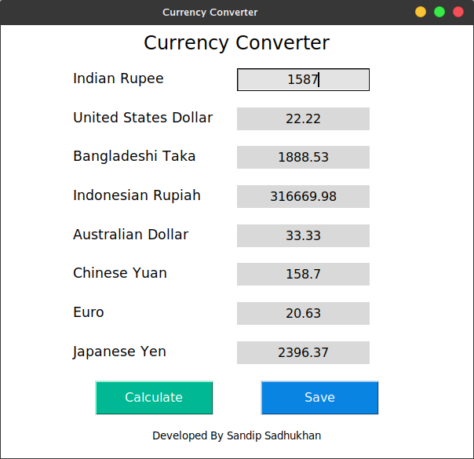

# Simple Currency Converter
It is a simple Currency Converter application developed by [sandip Sadhukhan](https://yourwebsite.github.io/) with **python**.

## Requirement
* python 3
## Download the Tool
go to your terminal or Command Prompt and write the following commands
```bash
git clone https://github.com/sandipsadhukhan/currencyConverter.git
```
## Run the Tool
### On Mac os/Linux
```bash
cd currencyConverter
python3 currencyConverter.py
```
### On Windows
```bash
cd currencyConverter
python currencyConverter.py
```
## Screenshot


## How to Use
1. First Type the Indian Currency in INR Box.
1. Then Click on ***Calculate*** Button. The Program automatically calculate INR into 7 different currency.
1. If you want to save the calculation table for future use then, click on ***save*** button. It will create a **currency.txt** file and save the data.You can see data by opening currency.txt file.

## Feature
* [x] Converted into 7 different currency unit
    * United States Dollar
    * Bangladeshi Taka
    * Indonesian Rupiah
    * Australian Dollar
    * Chinese Yuan
    * Euro
    * Japanese Yen
* [x] Save Currency in _.txt_ file

---
## Sponsors
<a href="https://youtube.com/c/bongtuts"></a>